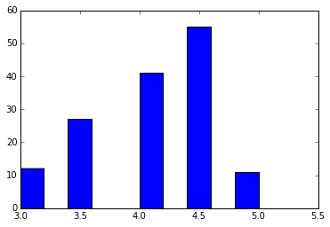
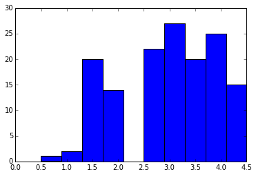
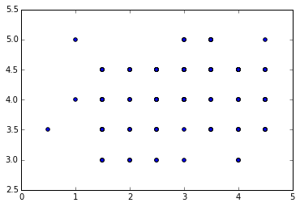

```python
import pandas

movies = pandas.read_csv("fandango_score_comparison.csv")
```


```python
movies
```


<div style="max-height:1000px;max-width:1500px;overflow:auto;">
<table border="1" class="dataframe">
  <thead>
    <tr style="text-align: right;">
      <th></th>
      <th>FILM</th>
      <th>RottenTomatoes</th>
      <th>RottenTomatoes_User</th>
      <th>Metacritic</th>
      <th>Metacritic_User</th>
      <th>IMDB</th>
      <th>Fandango_Stars</th>
      <th>Fandango_Ratingvalue</th>
      <th>RT_norm</th>
      <th>RT_user_norm</th>
      <th>...</th>
      <th>IMDB_norm</th>
      <th>RT_norm_round</th>
      <th>RT_user_norm_round</th>
      <th>Metacritic_norm_round</th>
      <th>Metacritic_user_norm_round</th>
      <th>IMDB_norm_round</th>
      <th>Metacritic_user_vote_count</th>
      <th>IMDB_user_vote_count</th>
      <th>Fandango_votes</th>
      <th>Fandango_Difference</th>
    </tr>
  </thead>
  <tbody>
    <tr>
      <th>0</th>
      <td>Avengers: Age of Ultron (2015)</td>
      <td>74</td>
      <td>86</td>
      <td>66</td>
      <td>7.1</td>
      <td>7.8</td>
      <td>5.0</td>
      <td>4.5</td>
      <td>3.70</td>
      <td>4.30</td>
      <td>...</td>
      <td>3.90</td>
      <td>3.5</td>
      <td>4.5</td>
      <td>3.5</td>
      <td>3.5</td>
      <td>4.0</td>
      <td>1330</td>
      <td>271107</td>
      <td>14846</td>
      <td>0.5</td>
    </tr>
    <tr>
      <th>1</th>
      <td>Cinderella (2015)</td>
      <td>85</td>
      <td>80</td>
      <td>67</td>
      <td>7.5</td>
      <td>7.1</td>
      <td>5.0</td>
      <td>4.5</td>
      <td>4.25</td>
      <td>4.00</td>
      <td>...</td>
      <td>3.55</td>
      <td>4.5</td>
      <td>4.0</td>
      <td>3.5</td>
      <td>4.0</td>
      <td>3.5</td>
      <td>249</td>
      <td>65709</td>
      <td>12640</td>
      <td>0.5</td>
    </tr>
    <tr>
      <th>2</th>
      <td>Ant-Man (2015)</td>
      <td>80</td>
      <td>90</td>
      <td>64</td>
      <td>8.1</td>
      <td>7.8</td>
      <td>5.0</td>
      <td>4.5</td>
      <td>4.00</td>
      <td>4.50</td>
      <td>...</td>
      <td>3.90</td>
      <td>4.0</td>
      <td>4.5</td>
      <td>3.0</td>
      <td>4.0</td>
      <td>4.0</td>
      <td>627</td>
      <td>103660</td>
      <td>12055</td>
      <td>0.5</td>
    </tr>
    <tr>
      <th>3</th>
      <td>Do You Believe? (2015)</td>
      <td>18</td>
      <td>84</td>
      <td>22</td>
      <td>4.7</td>
      <td>5.4</td>
      <td>5.0</td>
      <td>4.5</td>
      <td>0.90</td>
      <td>4.20</td>
      <td>...</td>
      <td>2.70</td>
      <td>1.0</td>
      <td>4.0</td>
      <td>1.0</td>
      <td>2.5</td>
      <td>2.5</td>
      <td>31</td>
      <td>3136</td>
      <td>1793</td>
      <td>0.5</td>
    </tr>
    <tr>
      <th>4</th>
      <td>Hot Tub Time Machine 2 (2015)</td>
      <td>14</td>
      <td>28</td>
      <td>29</td>
      <td>3.4</td>
      <td>5.1</td>
      <td>3.5</td>
      <td>3.0</td>
      <td>0.70</td>
      <td>1.40</td>
      <td>...</td>
      <td>2.55</td>
      <td>0.5</td>
      <td>1.5</td>
      <td>1.5</td>
      <td>1.5</td>
      <td>2.5</td>
      <td>88</td>
      <td>19560</td>
      <td>1021</td>
      <td>0.5</td>
    </tr>
    <tr>
      <th>5</th>
      <td>The Water Diviner (2015)</td>
      <td>63</td>
      <td>62</td>
      <td>50</td>
      <td>6.8</td>
      <td>7.2</td>
      <td>4.5</td>
      <td>4.0</td>
      <td>3.15</td>
      <td>3.10</td>
      <td>...</td>
      <td>3.60</td>
      <td>3.0</td>
      <td>3.0</td>
      <td>2.5</td>
      <td>3.5</td>
      <td>3.5</td>
      <td>34</td>
      <td>39373</td>
      <td>397</td>
      <td>0.5</td>
    </tr>
    <tr>
      <th>6</th>
      <td>Irrational Man (2015)</td>
      <td>42</td>
      <td>53</td>
      <td>53</td>
      <td>7.6</td>
      <td>6.9</td>
      <td>4.0</td>
      <td>3.5</td>
      <td>2.10</td>
      <td>2.65</td>
      <td>...</td>
      <td>3.45</td>
      <td>2.0</td>
      <td>2.5</td>
      <td>2.5</td>
      <td>4.0</td>
      <td>3.5</td>
      <td>17</td>
      <td>2680</td>
      <td>252</td>
      <td>0.5</td>
    </tr>
    <tr>
      <th>7</th>
      <td>Top Five (2014)</td>
      <td>86</td>
      <td>64</td>
      <td>81</td>
      <td>6.8</td>
      <td>6.5</td>
      <td>4.0</td>
      <td>3.5</td>
      <td>4.30</td>
      <td>3.20</td>
      <td>...</td>
      <td>3.25</td>
      <td>4.5</td>
      <td>3.0</td>
      <td>4.0</td>
      <td>3.5</td>
      <td>3.5</td>
      <td>124</td>
      <td>16876</td>
      <td>3223</td>
      <td>0.5</td>
    </tr>
    <tr>
      <th>8</th>
      <td>Shaun the Sheep Movie (2015)</td>
      <td>99</td>
      <td>82</td>
      <td>81</td>
      <td>8.8</td>
      <td>7.4</td>
      <td>4.5</td>
      <td>4.0</td>
      <td>4.95</td>
      <td>4.10</td>
      <td>...</td>
      <td>3.70</td>
      <td>5.0</td>
      <td>4.0</td>
      <td>4.0</td>
      <td>4.5</td>
      <td>3.5</td>
      <td>62</td>
      <td>12227</td>
      <td>896</td>
      <td>0.5</td>
    </tr>
    <tr>
      <th>9</th>
      <td>Love &amp; Mercy (2015)</td>
      <td>89</td>
      <td>87</td>
      <td>80</td>
      <td>8.5</td>
      <td>7.8</td>
      <td>4.5</td>
      <td>4.0</td>
      <td>4.45</td>
      <td>4.35</td>
      <td>...</td>
      <td>3.90</td>
      <td>4.5</td>
      <td>4.5</td>
      <td>4.0</td>
      <td>4.5</td>
      <td>4.0</td>
      <td>54</td>
      <td>5367</td>
      <td>864</td>
      <td>0.5</td>
    </tr>
    <tr>
      <th>10</th>
      <td>Far From The Madding Crowd (2015)</td>
      <td>84</td>
      <td>77</td>
      <td>71</td>
      <td>7.5</td>
      <td>7.2</td>
      <td>4.5</td>
      <td>4.0</td>
      <td>4.20</td>
      <td>3.85</td>
      <td>...</td>
      <td>3.60</td>
      <td>4.0</td>
      <td>4.0</td>
      <td>3.5</td>
      <td>4.0</td>
      <td>3.5</td>
      <td>35</td>
      <td>12129</td>
      <td>804</td>
      <td>0.5</td>
    </tr>
    <tr>
      <th>11</th>
      <td>Black Sea (2015)</td>
      <td>82</td>
      <td>60</td>
      <td>62</td>
      <td>6.6</td>
      <td>6.4</td>
      <td>4.0</td>
      <td>3.5</td>
      <td>4.10</td>
      <td>3.00</td>
      <td>...</td>
      <td>3.20</td>
      <td>4.0</td>
      <td>3.0</td>
      <td>3.0</td>
      <td>3.5</td>
      <td>3.0</td>
      <td>37</td>
      <td>16547</td>
      <td>218</td>
      <td>0.5</td>
    </tr>
    <tr>
      <th>12</th>
      <td>Leviathan (2014)</td>
      <td>99</td>
      <td>79</td>
      <td>92</td>
      <td>7.2</td>
      <td>7.7</td>
      <td>4.0</td>
      <td>3.5</td>
      <td>4.95</td>
      <td>3.95</td>
      <td>...</td>
      <td>3.85</td>
      <td>5.0</td>
      <td>4.0</td>
      <td>4.5</td>
      <td>3.5</td>
      <td>4.0</td>
      <td>145</td>
      <td>22521</td>
      <td>64</td>
      <td>0.5</td>
    </tr>
    <tr>
      <th>13</th>
      <td>Unbroken (2014)</td>
      <td>51</td>
      <td>70</td>
      <td>59</td>
      <td>6.5</td>
      <td>7.2</td>
      <td>4.5</td>
      <td>4.1</td>
      <td>2.55</td>
      <td>3.50</td>
      <td>...</td>
      <td>3.60</td>
      <td>2.5</td>
      <td>3.5</td>
      <td>3.0</td>
      <td>3.5</td>
      <td>3.5</td>
      <td>218</td>
      <td>77518</td>
      <td>9443</td>
      <td>0.4</td>
    </tr>
    <tr>
      <th>14</th>
      <td>The Imitation Game (2014)</td>
      <td>90</td>
      <td>92</td>
      <td>73</td>
      <td>8.2</td>
      <td>8.1</td>
      <td>5.0</td>
      <td>4.6</td>
      <td>4.50</td>
      <td>4.60</td>
      <td>...</td>
      <td>4.05</td>
      <td>4.5</td>
      <td>4.5</td>
      <td>3.5</td>
      <td>4.0</td>
      <td>4.0</td>
      <td>566</td>
      <td>334164</td>
      <td>8055</td>
      <td>0.4</td>
    </tr>
    <tr>
      <th>15</th>
      <td>Taken 3 (2015)</td>
      <td>9</td>
      <td>46</td>
      <td>26</td>
      <td>4.6</td>
      <td>6.1</td>
      <td>4.5</td>
      <td>4.1</td>
      <td>0.45</td>
      <td>2.30</td>
      <td>...</td>
      <td>3.05</td>
      <td>0.5</td>
      <td>2.5</td>
      <td>1.5</td>
      <td>2.5</td>
      <td>3.0</td>
      <td>240</td>
      <td>104235</td>
      <td>6757</td>
      <td>0.4</td>
    </tr>
    <tr>
      <th>16</th>
      <td>Ted 2 (2015)</td>
      <td>46</td>
      <td>58</td>
      <td>48</td>
      <td>6.5</td>
      <td>6.6</td>
      <td>4.5</td>
      <td>4.1</td>
      <td>2.30</td>
      <td>2.90</td>
      <td>...</td>
      <td>3.30</td>
      <td>2.5</td>
      <td>3.0</td>
      <td>2.5</td>
      <td>3.5</td>
      <td>3.5</td>
      <td>197</td>
      <td>49102</td>
      <td>6437</td>
      <td>0.4</td>
    </tr>
    <tr>
      <th>17</th>
      <td>Southpaw (2015)</td>
      <td>59</td>
      <td>80</td>
      <td>57</td>
      <td>8.2</td>
      <td>7.8</td>
      <td>5.0</td>
      <td>4.6</td>
      <td>2.95</td>
      <td>4.00</td>
      <td>...</td>
      <td>3.90</td>
      <td>3.0</td>
      <td>4.0</td>
      <td>3.0</td>
      <td>4.0</td>
      <td>4.0</td>
      <td>128</td>
      <td>23561</td>
      <td>5597</td>
      <td>0.4</td>
    </tr>
    <tr>
      <th>18</th>
      <td>Night at the Museum: Secret of the Tomb (2014)</td>
      <td>50</td>
      <td>58</td>
      <td>47</td>
      <td>5.8</td>
      <td>6.3</td>
      <td>4.5</td>
      <td>4.1</td>
      <td>2.50</td>
      <td>2.90</td>
      <td>...</td>
      <td>3.15</td>
      <td>2.5</td>
      <td>3.0</td>
      <td>2.5</td>
      <td>3.0</td>
      <td>3.0</td>
      <td>103</td>
      <td>50291</td>
      <td>5445</td>
      <td>0.4</td>
    </tr>
    <tr>
      <th>19</th>
      <td>Pixels (2015)</td>
      <td>17</td>
      <td>54</td>
      <td>27</td>
      <td>5.3</td>
      <td>5.6</td>
      <td>4.5</td>
      <td>4.1</td>
      <td>0.85</td>
      <td>2.70</td>
      <td>...</td>
      <td>2.80</td>
      <td>1.0</td>
      <td>2.5</td>
      <td>1.5</td>
      <td>2.5</td>
      <td>3.0</td>
      <td>246</td>
      <td>19521</td>
      <td>3886</td>
      <td>0.4</td>
    </tr>
    <tr>
      <th>20</th>
      <td>McFarland, USA (2015)</td>
      <td>79</td>
      <td>89</td>
      <td>60</td>
      <td>7.2</td>
      <td>7.5</td>
      <td>5.0</td>
      <td>4.6</td>
      <td>3.95</td>
      <td>4.45</td>
      <td>...</td>
      <td>3.75</td>
      <td>4.0</td>
      <td>4.5</td>
      <td>3.0</td>
      <td>3.5</td>
      <td>4.0</td>
      <td>59</td>
      <td>13769</td>
      <td>3364</td>
      <td>0.4</td>
    </tr>
    <tr>
      <th>21</th>
      <td>Insidious: Chapter 3 (2015)</td>
      <td>59</td>
      <td>56</td>
      <td>52</td>
      <td>6.9</td>
      <td>6.3</td>
      <td>4.5</td>
      <td>4.1</td>
      <td>2.95</td>
      <td>2.80</td>
      <td>...</td>
      <td>3.15</td>
      <td>3.0</td>
      <td>3.0</td>
      <td>2.5</td>
      <td>3.5</td>
      <td>3.0</td>
      <td>115</td>
      <td>25134</td>
      <td>3276</td>
      <td>0.4</td>
    </tr>
    <tr>
      <th>22</th>
      <td>The Man From U.N.C.L.E. (2015)</td>
      <td>68</td>
      <td>80</td>
      <td>55</td>
      <td>7.9</td>
      <td>7.6</td>
      <td>4.5</td>
      <td>4.1</td>
      <td>3.40</td>
      <td>4.00</td>
      <td>...</td>
      <td>3.80</td>
      <td>3.5</td>
      <td>4.0</td>
      <td>3.0</td>
      <td>4.0</td>
      <td>4.0</td>
      <td>144</td>
      <td>22104</td>
      <td>2686</td>
      <td>0.4</td>
    </tr>
    <tr>
      <th>23</th>
      <td>Run All Night (2015)</td>
      <td>60</td>
      <td>59</td>
      <td>59</td>
      <td>7.3</td>
      <td>6.6</td>
      <td>4.5</td>
      <td>4.1</td>
      <td>3.00</td>
      <td>2.95</td>
      <td>...</td>
      <td>3.30</td>
      <td>3.0</td>
      <td>3.0</td>
      <td>3.0</td>
      <td>3.5</td>
      <td>3.5</td>
      <td>141</td>
      <td>50438</td>
      <td>2066</td>
      <td>0.4</td>
    </tr>
    <tr>
      <th>24</th>
      <td>Trainwreck (2015)</td>
      <td>85</td>
      <td>74</td>
      <td>75</td>
      <td>6.0</td>
      <td>6.7</td>
      <td>4.5</td>
      <td>4.1</td>
      <td>4.25</td>
      <td>3.70</td>
      <td>...</td>
      <td>3.35</td>
      <td>4.5</td>
      <td>3.5</td>
      <td>4.0</td>
      <td>3.0</td>
      <td>3.5</td>
      <td>169</td>
      <td>27380</td>
      <td>8381</td>
      <td>0.4</td>
    </tr>
    <tr>
      <th>25</th>
      <td>Selma (2014)</td>
      <td>99</td>
      <td>86</td>
      <td>89</td>
      <td>7.1</td>
      <td>7.5</td>
      <td>5.0</td>
      <td>4.6</td>
      <td>4.95</td>
      <td>4.30</td>
      <td>...</td>
      <td>3.75</td>
      <td>5.0</td>
      <td>4.5</td>
      <td>4.5</td>
      <td>3.5</td>
      <td>4.0</td>
      <td>316</td>
      <td>45344</td>
      <td>7025</td>
      <td>0.4</td>
    </tr>
    <tr>
      <th>26</th>
      <td>Ex Machina (2015)</td>
      <td>92</td>
      <td>86</td>
      <td>78</td>
      <td>7.9</td>
      <td>7.7</td>
      <td>4.5</td>
      <td>4.1</td>
      <td>4.60</td>
      <td>4.30</td>
      <td>...</td>
      <td>3.85</td>
      <td>4.5</td>
      <td>4.5</td>
      <td>4.0</td>
      <td>4.0</td>
      <td>4.0</td>
      <td>672</td>
      <td>154499</td>
      <td>3458</td>
      <td>0.4</td>
    </tr>
    <tr>
      <th>27</th>
      <td>Still Alice (2015)</td>
      <td>88</td>
      <td>85</td>
      <td>72</td>
      <td>7.8</td>
      <td>7.5</td>
      <td>4.5</td>
      <td>4.1</td>
      <td>4.40</td>
      <td>4.25</td>
      <td>...</td>
      <td>3.75</td>
      <td>4.5</td>
      <td>4.5</td>
      <td>3.5</td>
      <td>4.0</td>
      <td>4.0</td>
      <td>153</td>
      <td>57123</td>
      <td>1258</td>
      <td>0.4</td>
    </tr>
    <tr>
      <th>28</th>
      <td>Wild Tales (2014)</td>
      <td>96</td>
      <td>92</td>
      <td>77</td>
      <td>8.8</td>
      <td>8.2</td>
      <td>4.5</td>
      <td>4.1</td>
      <td>4.80</td>
      <td>4.60</td>
      <td>...</td>
      <td>4.10</td>
      <td>5.0</td>
      <td>4.5</td>
      <td>4.0</td>
      <td>4.5</td>
      <td>4.0</td>
      <td>107</td>
      <td>50285</td>
      <td>235</td>
      <td>0.4</td>
    </tr>
    <tr>
      <th>29</th>
      <td>The End of the Tour (2015)</td>
      <td>92</td>
      <td>89</td>
      <td>84</td>
      <td>7.5</td>
      <td>7.9</td>
      <td>4.5</td>
      <td>4.1</td>
      <td>4.60</td>
      <td>4.45</td>
      <td>...</td>
      <td>3.95</td>
      <td>4.5</td>
      <td>4.5</td>
      <td>4.0</td>
      <td>4.0</td>
      <td>4.0</td>
      <td>19</td>
      <td>1320</td>
      <td>121</td>
      <td>0.4</td>
    </tr>
    <tr>
      <th>...</th>
      <td>...</td>
      <td>...</td>
      <td>...</td>
      <td>...</td>
      <td>...</td>
      <td>...</td>
      <td>...</td>
      <td>...</td>
      <td>...</td>
      <td>...</td>
      <td>...</td>
      <td>...</td>
      <td>...</td>
      <td>...</td>
      <td>...</td>
      <td>...</td>
      <td>...</td>
      <td>...</td>
      <td>...</td>
      <td>...</td>
      <td>...</td>
    </tr>
    <tr>
      <th>116</th>
      <td>Clouds of Sils Maria (2015)</td>
      <td>89</td>
      <td>67</td>
      <td>78</td>
      <td>7.1</td>
      <td>6.8</td>
      <td>3.5</td>
      <td>3.4</td>
      <td>4.45</td>
      <td>3.35</td>
      <td>...</td>
      <td>3.40</td>
      <td>4.5</td>
      <td>3.5</td>
      <td>4.0</td>
      <td>3.5</td>
      <td>3.5</td>
      <td>36</td>
      <td>11392</td>
      <td>162</td>
      <td>0.1</td>
    </tr>
    <tr>
      <th>117</th>
      <td>Testament of Youth (2015)</td>
      <td>81</td>
      <td>79</td>
      <td>77</td>
      <td>7.9</td>
      <td>7.3</td>
      <td>4.0</td>
      <td>3.9</td>
      <td>4.05</td>
      <td>3.95</td>
      <td>...</td>
      <td>3.65</td>
      <td>4.0</td>
      <td>4.0</td>
      <td>4.0</td>
      <td>4.0</td>
      <td>3.5</td>
      <td>15</td>
      <td>5495</td>
      <td>127</td>
      <td>0.1</td>
    </tr>
    <tr>
      <th>118</th>
      <td>Infinitely Polar Bear (2015)</td>
      <td>80</td>
      <td>76</td>
      <td>64</td>
      <td>7.9</td>
      <td>7.2</td>
      <td>4.0</td>
      <td>3.9</td>
      <td>4.00</td>
      <td>3.80</td>
      <td>...</td>
      <td>3.60</td>
      <td>4.0</td>
      <td>4.0</td>
      <td>3.0</td>
      <td>4.0</td>
      <td>3.5</td>
      <td>8</td>
      <td>1062</td>
      <td>124</td>
      <td>0.1</td>
    </tr>
    <tr>
      <th>119</th>
      <td>Phoenix (2015)</td>
      <td>99</td>
      <td>81</td>
      <td>91</td>
      <td>8.0</td>
      <td>7.2</td>
      <td>3.5</td>
      <td>3.4</td>
      <td>4.95</td>
      <td>4.05</td>
      <td>...</td>
      <td>3.60</td>
      <td>5.0</td>
      <td>4.0</td>
      <td>4.5</td>
      <td>4.0</td>
      <td>3.5</td>
      <td>21</td>
      <td>3687</td>
      <td>70</td>
      <td>0.1</td>
    </tr>
    <tr>
      <th>120</th>
      <td>The Wolfpack (2015)</td>
      <td>84</td>
      <td>73</td>
      <td>75</td>
      <td>7.0</td>
      <td>7.1</td>
      <td>3.5</td>
      <td>3.4</td>
      <td>4.20</td>
      <td>3.65</td>
      <td>...</td>
      <td>3.55</td>
      <td>4.0</td>
      <td>3.5</td>
      <td>4.0</td>
      <td>3.5</td>
      <td>3.5</td>
      <td>8</td>
      <td>1488</td>
      <td>66</td>
      <td>0.1</td>
    </tr>
    <tr>
      <th>121</th>
      <td>The Stanford Prison Experiment (2015)</td>
      <td>84</td>
      <td>87</td>
      <td>68</td>
      <td>8.5</td>
      <td>7.1</td>
      <td>4.0</td>
      <td>3.9</td>
      <td>4.20</td>
      <td>4.35</td>
      <td>...</td>
      <td>3.55</td>
      <td>4.0</td>
      <td>4.5</td>
      <td>3.5</td>
      <td>4.5</td>
      <td>3.5</td>
      <td>6</td>
      <td>950</td>
      <td>51</td>
      <td>0.1</td>
    </tr>
    <tr>
      <th>122</th>
      <td>Tangerine (2015)</td>
      <td>95</td>
      <td>86</td>
      <td>86</td>
      <td>7.3</td>
      <td>7.4</td>
      <td>4.0</td>
      <td>3.9</td>
      <td>4.75</td>
      <td>4.30</td>
      <td>...</td>
      <td>3.70</td>
      <td>5.0</td>
      <td>4.5</td>
      <td>4.5</td>
      <td>3.5</td>
      <td>3.5</td>
      <td>14</td>
      <td>696</td>
      <td>36</td>
      <td>0.1</td>
    </tr>
    <tr>
      <th>123</th>
      <td>Magic Mike XXL (2015)</td>
      <td>62</td>
      <td>64</td>
      <td>60</td>
      <td>5.4</td>
      <td>6.3</td>
      <td>4.5</td>
      <td>4.4</td>
      <td>3.10</td>
      <td>3.20</td>
      <td>...</td>
      <td>3.15</td>
      <td>3.0</td>
      <td>3.0</td>
      <td>3.0</td>
      <td>2.5</td>
      <td>3.0</td>
      <td>52</td>
      <td>11937</td>
      <td>9363</td>
      <td>0.1</td>
    </tr>
    <tr>
      <th>124</th>
      <td>Home (2015)</td>
      <td>45</td>
      <td>65</td>
      <td>55</td>
      <td>7.3</td>
      <td>6.7</td>
      <td>4.5</td>
      <td>4.4</td>
      <td>2.25</td>
      <td>3.25</td>
      <td>...</td>
      <td>3.35</td>
      <td>2.5</td>
      <td>3.5</td>
      <td>3.0</td>
      <td>3.5</td>
      <td>3.5</td>
      <td>177</td>
      <td>41158</td>
      <td>7705</td>
      <td>0.1</td>
    </tr>
    <tr>
      <th>125</th>
      <td>The Wedding Ringer (2015)</td>
      <td>27</td>
      <td>66</td>
      <td>35</td>
      <td>3.3</td>
      <td>6.7</td>
      <td>4.5</td>
      <td>4.4</td>
      <td>1.35</td>
      <td>3.30</td>
      <td>...</td>
      <td>3.35</td>
      <td>1.5</td>
      <td>3.5</td>
      <td>2.0</td>
      <td>1.5</td>
      <td>3.5</td>
      <td>126</td>
      <td>37292</td>
      <td>6506</td>
      <td>0.1</td>
    </tr>
    <tr>
      <th>126</th>
      <td>Woman in Gold (2015)</td>
      <td>52</td>
      <td>81</td>
      <td>51</td>
      <td>7.2</td>
      <td>7.4</td>
      <td>4.5</td>
      <td>4.4</td>
      <td>2.60</td>
      <td>4.05</td>
      <td>...</td>
      <td>3.70</td>
      <td>2.5</td>
      <td>4.0</td>
      <td>2.5</td>
      <td>3.5</td>
      <td>3.5</td>
      <td>72</td>
      <td>17957</td>
      <td>2435</td>
      <td>0.1</td>
    </tr>
    <tr>
      <th>127</th>
      <td>The Last Five Years (2015)</td>
      <td>60</td>
      <td>60</td>
      <td>60</td>
      <td>6.9</td>
      <td>6.0</td>
      <td>4.5</td>
      <td>4.4</td>
      <td>3.00</td>
      <td>3.00</td>
      <td>...</td>
      <td>3.00</td>
      <td>3.0</td>
      <td>3.0</td>
      <td>3.0</td>
      <td>3.5</td>
      <td>3.0</td>
      <td>20</td>
      <td>4110</td>
      <td>99</td>
      <td>0.1</td>
    </tr>
    <tr>
      <th>128</th>
      <td>Mission: Impossible – Rogue Nation (2015)</td>
      <td>92</td>
      <td>90</td>
      <td>75</td>
      <td>8.0</td>
      <td>7.8</td>
      <td>4.5</td>
      <td>4.4</td>
      <td>4.60</td>
      <td>4.50</td>
      <td>...</td>
      <td>3.90</td>
      <td>4.5</td>
      <td>4.5</td>
      <td>4.0</td>
      <td>4.0</td>
      <td>4.0</td>
      <td>362</td>
      <td>82579</td>
      <td>8357</td>
      <td>0.1</td>
    </tr>
    <tr>
      <th>129</th>
      <td>Amy (2015)</td>
      <td>97</td>
      <td>91</td>
      <td>85</td>
      <td>8.8</td>
      <td>8.0</td>
      <td>4.5</td>
      <td>4.4</td>
      <td>4.85</td>
      <td>4.55</td>
      <td>...</td>
      <td>4.00</td>
      <td>5.0</td>
      <td>4.5</td>
      <td>4.5</td>
      <td>4.5</td>
      <td>4.0</td>
      <td>60</td>
      <td>5630</td>
      <td>729</td>
      <td>0.1</td>
    </tr>
    <tr>
      <th>130</th>
      <td>Jurassic World (2015)</td>
      <td>71</td>
      <td>81</td>
      <td>59</td>
      <td>7.0</td>
      <td>7.3</td>
      <td>4.5</td>
      <td>4.5</td>
      <td>3.55</td>
      <td>4.05</td>
      <td>...</td>
      <td>3.65</td>
      <td>3.5</td>
      <td>4.0</td>
      <td>3.0</td>
      <td>3.5</td>
      <td>3.5</td>
      <td>1281</td>
      <td>241807</td>
      <td>34390</td>
      <td>0.0</td>
    </tr>
    <tr>
      <th>131</th>
      <td>Minions (2015)</td>
      <td>54</td>
      <td>52</td>
      <td>56</td>
      <td>5.7</td>
      <td>6.7</td>
      <td>4.0</td>
      <td>4.0</td>
      <td>2.70</td>
      <td>2.60</td>
      <td>...</td>
      <td>3.35</td>
      <td>2.5</td>
      <td>2.5</td>
      <td>3.0</td>
      <td>3.0</td>
      <td>3.5</td>
      <td>204</td>
      <td>55895</td>
      <td>14998</td>
      <td>0.0</td>
    </tr>
    <tr>
      <th>132</th>
      <td>Max (2015)</td>
      <td>35</td>
      <td>73</td>
      <td>47</td>
      <td>5.9</td>
      <td>7.0</td>
      <td>4.5</td>
      <td>4.5</td>
      <td>1.75</td>
      <td>3.65</td>
      <td>...</td>
      <td>3.50</td>
      <td>2.0</td>
      <td>3.5</td>
      <td>2.5</td>
      <td>3.0</td>
      <td>3.5</td>
      <td>15</td>
      <td>5444</td>
      <td>3412</td>
      <td>0.0</td>
    </tr>
    <tr>
      <th>133</th>
      <td>Paul Blart: Mall Cop 2 (2015)</td>
      <td>5</td>
      <td>36</td>
      <td>13</td>
      <td>2.4</td>
      <td>4.3</td>
      <td>3.5</td>
      <td>3.5</td>
      <td>0.25</td>
      <td>1.80</td>
      <td>...</td>
      <td>2.15</td>
      <td>0.5</td>
      <td>2.0</td>
      <td>0.5</td>
      <td>1.0</td>
      <td>2.0</td>
      <td>211</td>
      <td>15004</td>
      <td>3054</td>
      <td>0.0</td>
    </tr>
    <tr>
      <th>134</th>
      <td>The Longest Ride (2015)</td>
      <td>31</td>
      <td>73</td>
      <td>33</td>
      <td>4.8</td>
      <td>7.2</td>
      <td>4.5</td>
      <td>4.5</td>
      <td>1.55</td>
      <td>3.65</td>
      <td>...</td>
      <td>3.60</td>
      <td>1.5</td>
      <td>3.5</td>
      <td>1.5</td>
      <td>2.5</td>
      <td>3.5</td>
      <td>49</td>
      <td>25214</td>
      <td>2603</td>
      <td>0.0</td>
    </tr>
    <tr>
      <th>135</th>
      <td>The Lazarus Effect (2015)</td>
      <td>14</td>
      <td>23</td>
      <td>31</td>
      <td>4.9</td>
      <td>5.2</td>
      <td>3.0</td>
      <td>3.0</td>
      <td>0.70</td>
      <td>1.15</td>
      <td>...</td>
      <td>2.60</td>
      <td>0.5</td>
      <td>1.0</td>
      <td>1.5</td>
      <td>2.5</td>
      <td>2.5</td>
      <td>62</td>
      <td>17691</td>
      <td>1651</td>
      <td>0.0</td>
    </tr>
    <tr>
      <th>136</th>
      <td>The Woman In Black 2 Angel of Death (2015)</td>
      <td>22</td>
      <td>25</td>
      <td>42</td>
      <td>4.4</td>
      <td>4.9</td>
      <td>3.0</td>
      <td>3.0</td>
      <td>1.10</td>
      <td>1.25</td>
      <td>...</td>
      <td>2.45</td>
      <td>1.0</td>
      <td>1.5</td>
      <td>2.0</td>
      <td>2.0</td>
      <td>2.5</td>
      <td>55</td>
      <td>14873</td>
      <td>1333</td>
      <td>0.0</td>
    </tr>
    <tr>
      <th>137</th>
      <td>Danny Collins (2015)</td>
      <td>77</td>
      <td>75</td>
      <td>58</td>
      <td>7.1</td>
      <td>7.1</td>
      <td>4.0</td>
      <td>4.0</td>
      <td>3.85</td>
      <td>3.75</td>
      <td>...</td>
      <td>3.55</td>
      <td>4.0</td>
      <td>4.0</td>
      <td>3.0</td>
      <td>3.5</td>
      <td>3.5</td>
      <td>33</td>
      <td>11206</td>
      <td>531</td>
      <td>0.0</td>
    </tr>
    <tr>
      <th>138</th>
      <td>Spare Parts (2015)</td>
      <td>52</td>
      <td>83</td>
      <td>50</td>
      <td>7.1</td>
      <td>7.2</td>
      <td>4.5</td>
      <td>4.5</td>
      <td>2.60</td>
      <td>4.15</td>
      <td>...</td>
      <td>3.60</td>
      <td>2.5</td>
      <td>4.0</td>
      <td>2.5</td>
      <td>3.5</td>
      <td>3.5</td>
      <td>7</td>
      <td>47377</td>
      <td>450</td>
      <td>0.0</td>
    </tr>
    <tr>
      <th>139</th>
      <td>Serena (2015)</td>
      <td>18</td>
      <td>25</td>
      <td>36</td>
      <td>5.3</td>
      <td>5.4</td>
      <td>3.0</td>
      <td>3.0</td>
      <td>0.90</td>
      <td>1.25</td>
      <td>...</td>
      <td>2.70</td>
      <td>1.0</td>
      <td>1.5</td>
      <td>2.0</td>
      <td>2.5</td>
      <td>2.5</td>
      <td>19</td>
      <td>12165</td>
      <td>50</td>
      <td>0.0</td>
    </tr>
    <tr>
      <th>140</th>
      <td>Inside Out (2015)</td>
      <td>98</td>
      <td>90</td>
      <td>94</td>
      <td>8.9</td>
      <td>8.6</td>
      <td>4.5</td>
      <td>4.5</td>
      <td>4.90</td>
      <td>4.50</td>
      <td>...</td>
      <td>4.30</td>
      <td>5.0</td>
      <td>4.5</td>
      <td>4.5</td>
      <td>4.5</td>
      <td>4.5</td>
      <td>807</td>
      <td>96252</td>
      <td>15749</td>
      <td>0.0</td>
    </tr>
    <tr>
      <th>141</th>
      <td>Mr. Holmes (2015)</td>
      <td>87</td>
      <td>78</td>
      <td>67</td>
      <td>7.9</td>
      <td>7.4</td>
      <td>4.0</td>
      <td>4.0</td>
      <td>4.35</td>
      <td>3.90</td>
      <td>...</td>
      <td>3.70</td>
      <td>4.5</td>
      <td>4.0</td>
      <td>3.5</td>
      <td>4.0</td>
      <td>3.5</td>
      <td>33</td>
      <td>7367</td>
      <td>1348</td>
      <td>0.0</td>
    </tr>
    <tr>
      <th>142</th>
      <td>'71 (2015)</td>
      <td>97</td>
      <td>82</td>
      <td>83</td>
      <td>7.5</td>
      <td>7.2</td>
      <td>3.5</td>
      <td>3.5</td>
      <td>4.85</td>
      <td>4.10</td>
      <td>...</td>
      <td>3.60</td>
      <td>5.0</td>
      <td>4.0</td>
      <td>4.0</td>
      <td>4.0</td>
      <td>3.5</td>
      <td>60</td>
      <td>24116</td>
      <td>192</td>
      <td>0.0</td>
    </tr>
    <tr>
      <th>143</th>
      <td>Two Days, One Night (2014)</td>
      <td>97</td>
      <td>78</td>
      <td>89</td>
      <td>8.8</td>
      <td>7.4</td>
      <td>3.5</td>
      <td>3.5</td>
      <td>4.85</td>
      <td>3.90</td>
      <td>...</td>
      <td>3.70</td>
      <td>5.0</td>
      <td>4.0</td>
      <td>4.5</td>
      <td>4.5</td>
      <td>3.5</td>
      <td>123</td>
      <td>24345</td>
      <td>118</td>
      <td>0.0</td>
    </tr>
    <tr>
      <th>144</th>
      <td>Gett: The Trial of Viviane Amsalem (2015)</td>
      <td>100</td>
      <td>81</td>
      <td>90</td>
      <td>7.3</td>
      <td>7.8</td>
      <td>3.5</td>
      <td>3.5</td>
      <td>5.00</td>
      <td>4.05</td>
      <td>...</td>
      <td>3.90</td>
      <td>5.0</td>
      <td>4.0</td>
      <td>4.5</td>
      <td>3.5</td>
      <td>4.0</td>
      <td>19</td>
      <td>1955</td>
      <td>59</td>
      <td>0.0</td>
    </tr>
    <tr>
      <th>145</th>
      <td>Kumiko, The Treasure Hunter (2015)</td>
      <td>87</td>
      <td>63</td>
      <td>68</td>
      <td>6.4</td>
      <td>6.7</td>
      <td>3.5</td>
      <td>3.5</td>
      <td>4.35</td>
      <td>3.15</td>
      <td>...</td>
      <td>3.35</td>
      <td>4.5</td>
      <td>3.0</td>
      <td>3.5</td>
      <td>3.0</td>
      <td>3.5</td>
      <td>19</td>
      <td>5289</td>
      <td>41</td>
      <td>0.0</td>
    </tr>
  </tbody>
</table>
<p>146 rows × 22 columns</p>
</div>


```python
import matplotlib.pyplot as plt
%matplotlib inline

plt.hist(movies["Fandango_Stars"])
```


    (array([ 12.,   0.,  27.,   0.,   0.,  41.,   0.,  55.,   0.,  11.]),
     array([ 3. ,  3.2,  3.4,  3.6,  3.8,  4. ,  4.2,  4.4,  4.6,  4.8,  5. ]),
     <a list of 10 Patch objects>)





```python
plt.hist(movies["Metacritic_norm_round"])
```


    (array([  1.,   2.,  20.,  14.,   0.,  22.,  27.,  20.,  25.,  15.]),
     array([ 0.5,  0.9,  1.3,  1.7,  2.1,  2.5,  2.9,  3.3,  3.7,  4.1,  4.5]),
     <a list of 10 Patch objects>)





## Fandango vs Metacritic Scores

There are no scores below a `3.0` in the Fandango reviews.  The Fandango reviews also tend to center around `4.5` and `4.0`, whereas the Metacritic reviews seem to center around `3.0` and `3.5`.


```python
import numpy

f_mean = movies["Fandango_Stars"].mean()
m_mean = movies["Metacritic_norm_round"].mean()
f_std = movies["Fandango_Stars"].std()
m_std = movies["Metacritic_norm_round"].std()
f_median = movies["Fandango_Stars"].median()
m_median = movies["Metacritic_norm_round"].median()

print(f_mean)
print(m_mean)
print(f_std)
print(m_std)
print(f_median)
print(m_median)
```

    4.08904109589
    2.97260273973
    0.540385977979
    0.990960561374
    4.0
    3.0


## Fandango vs Metacritic Methodology

Fandango appears to inflate ratings and isn't transparent about how it calculates and aggregates ratings.  Metacritic publishes each individual critic rating, and is transparent about how they aggregate them to get a final rating.

## Fandango vs Metacritic number differences

The median metacritic score appears higher than the mean metacritic score because a few very low reviews "drag down" the median.  The median fandango score is lower than the mean fandango score because a few very high ratings "drag up" the mean.

Fandango ratings appear clustered between `3` and `5`, and have a much narrower random than Metacritic reviews, which go from `0` to `5`.

Fandango ratings in general appear to be higher than metacritic ratings.

These may be due to movie studio influence on Fandango ratings, and the fact that Fandango calculates its ratings in a hidden way.


```python
plt.scatter(movies["Metacritic_norm_round"], movies["Fandango_Stars"])
```


    <matplotlib.collections.PathCollection at 0x1079dc7b8>





```python
movies["fm_diff"] = numpy.abs(movies["Metacritic_norm_round"] - movies["Fandango_Stars"])
```


```python
movies.sort("fm_diff", ascending=False).head(5)
```


<div style="max-height:1000px;max-width:1500px;overflow:auto;">
<table border="1" class="dataframe">
  <thead>
    <tr style="text-align: right;">
      <th></th>
      <th>FILM</th>
      <th>RottenTomatoes</th>
      <th>RottenTomatoes_User</th>
      <th>Metacritic</th>
      <th>Metacritic_User</th>
      <th>IMDB</th>
      <th>Fandango_Stars</th>
      <th>Fandango_Ratingvalue</th>
      <th>RT_norm</th>
      <th>RT_user_norm</th>
      <th>...</th>
      <th>RT_norm_round</th>
      <th>RT_user_norm_round</th>
      <th>Metacritic_norm_round</th>
      <th>Metacritic_user_norm_round</th>
      <th>IMDB_norm_round</th>
      <th>Metacritic_user_vote_count</th>
      <th>IMDB_user_vote_count</th>
      <th>Fandango_votes</th>
      <th>Fandango_Difference</th>
      <th>fm_diff</th>
    </tr>
  </thead>
  <tbody>
    <tr>
      <th>3</th>
      <td>Do You Believe? (2015)</td>
      <td>18</td>
      <td>84</td>
      <td>22</td>
      <td>4.7</td>
      <td>5.4</td>
      <td>5.0</td>
      <td>4.5</td>
      <td>0.90</td>
      <td>4.20</td>
      <td>...</td>
      <td>1.0</td>
      <td>4.0</td>
      <td>1.0</td>
      <td>2.5</td>
      <td>2.5</td>
      <td>31</td>
      <td>3136</td>
      <td>1793</td>
      <td>0.5</td>
      <td>4</td>
    </tr>
    <tr>
      <th>85</th>
      <td>Little Boy (2015)</td>
      <td>20</td>
      <td>81</td>
      <td>30</td>
      <td>5.9</td>
      <td>7.4</td>
      <td>4.5</td>
      <td>4.3</td>
      <td>1.00</td>
      <td>4.05</td>
      <td>...</td>
      <td>1.0</td>
      <td>4.0</td>
      <td>1.5</td>
      <td>3.0</td>
      <td>3.5</td>
      <td>38</td>
      <td>5927</td>
      <td>811</td>
      <td>0.2</td>
      <td>3</td>
    </tr>
    <tr>
      <th>47</th>
      <td>Annie (2014)</td>
      <td>27</td>
      <td>61</td>
      <td>33</td>
      <td>4.8</td>
      <td>5.2</td>
      <td>4.5</td>
      <td>4.2</td>
      <td>1.35</td>
      <td>3.05</td>
      <td>...</td>
      <td>1.5</td>
      <td>3.0</td>
      <td>1.5</td>
      <td>2.5</td>
      <td>2.5</td>
      <td>108</td>
      <td>19222</td>
      <td>6835</td>
      <td>0.3</td>
      <td>3</td>
    </tr>
    <tr>
      <th>19</th>
      <td>Pixels (2015)</td>
      <td>17</td>
      <td>54</td>
      <td>27</td>
      <td>5.3</td>
      <td>5.6</td>
      <td>4.5</td>
      <td>4.1</td>
      <td>0.85</td>
      <td>2.70</td>
      <td>...</td>
      <td>1.0</td>
      <td>2.5</td>
      <td>1.5</td>
      <td>2.5</td>
      <td>3.0</td>
      <td>246</td>
      <td>19521</td>
      <td>3886</td>
      <td>0.4</td>
      <td>3</td>
    </tr>
    <tr>
      <th>134</th>
      <td>The Longest Ride (2015)</td>
      <td>31</td>
      <td>73</td>
      <td>33</td>
      <td>4.8</td>
      <td>7.2</td>
      <td>4.5</td>
      <td>4.5</td>
      <td>1.55</td>
      <td>3.65</td>
      <td>...</td>
      <td>1.5</td>
      <td>3.5</td>
      <td>1.5</td>
      <td>2.5</td>
      <td>3.5</td>
      <td>49</td>
      <td>25214</td>
      <td>2603</td>
      <td>0.0</td>
      <td>3</td>
    </tr>
  </tbody>
</table>
<p>5 rows × 23 columns</p>
</div>


```python
from scipy.stats import pearsonr

r_value, p_value = pearsonr(movies["Fandango_Stars"], movies["Metacritic_norm_round"])

r_value
```


    0.17844919073895918


## Fandango and Metacritic correlation

The low correlation between Fandango and Metacritic scores indicates that Fandango scores aren't just inflated, they are fundamentally different.  For whatever reason, it appears like Fandango both inflates scores overall, and inflates scores differently depending on the movie.


```python
from scipy.stats import linregress

slope, intercept, r_value, p_value, stderr_slope = linregress(movies["Metacritic_norm_round"], movies["Fandango_Stars"])
```


    0.17844919073895915


```python
pred = 3 * slope + intercept

pred
```


    4.0917071528212032


