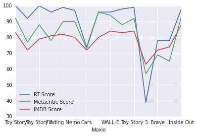
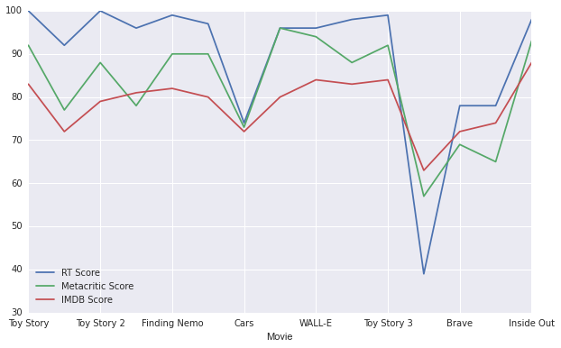
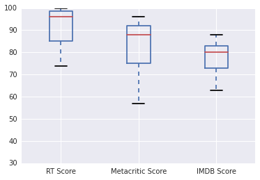
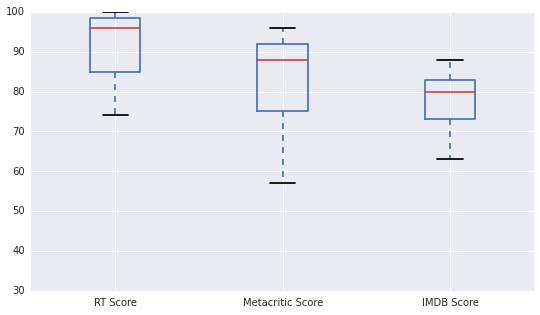
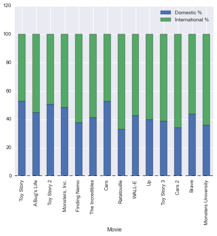
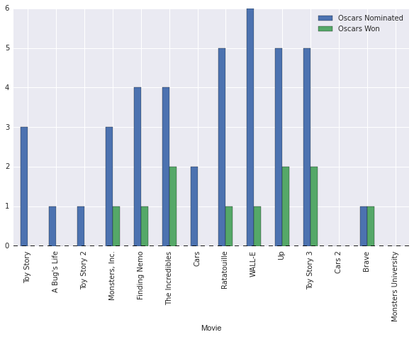

# Introduction to the data


```python
import pandas as pd
import seaborn as sns
import matplotlib.pyplot as plt
%matplotlib inline

pixar_movies = pd.read_csv("PixarMovies.csv")
# Number of rows
print(pixar_movies.shape[0])
```

    15


```python
# Number of columns
print(pixar_movies.shape[1])
```

    16


```python
pixar_movies.head(15)
```


<div style="max-height:1000px;max-width:1500px;overflow:auto;">
<table border="1" class="dataframe">
  <thead>
    <tr style="text-align: right;">
      <th></th>
      <th>Year Released</th>
      <th>Movie</th>
      <th>Length</th>
      <th>RT Score</th>
      <th>IMDB Score</th>
      <th>Metacritic Score</th>
      <th>Opening Weekend</th>
      <th>Worldwide Gross</th>
      <th>Domestic Gross</th>
      <th>Adjusted Domestic Gross</th>
      <th>International Gross</th>
      <th>Domestic %</th>
      <th>International %</th>
      <th>Production Budget</th>
      <th>Oscars Nominated</th>
      <th>Oscars Won</th>
    </tr>
  </thead>
  <tbody>
    <tr>
      <th>0 </th>
      <td> 1995</td>
      <td>           Toy Story</td>
      <td>  81</td>
      <td> 100</td>
      <td> 8.3</td>
      <td> 92</td>
      <td>  29.14</td>
      <td>  362.0</td>
      <td> 191.8</td>
      <td> 356.21</td>
      <td> 170.2</td>
      <td> 52.98%</td>
      <td> 47.02%</td>
      <td>  30</td>
      <td>  3</td>
      <td>  0</td>
    </tr>
    <tr>
      <th>1 </th>
      <td> 1998</td>
      <td>        A Bug's Life</td>
      <td>  96</td>
      <td>  92</td>
      <td> 7.2</td>
      <td> 77</td>
      <td>  33.26</td>
      <td>  363.4</td>
      <td> 162.8</td>
      <td> 277.18</td>
      <td> 200.6</td>
      <td> 44.80%</td>
      <td> 55.20%</td>
      <td>  45</td>
      <td>  1</td>
      <td>  0</td>
    </tr>
    <tr>
      <th>2 </th>
      <td> 1999</td>
      <td>         Toy Story 2</td>
      <td>  92</td>
      <td> 100</td>
      <td> 7.9</td>
      <td> 88</td>
      <td>  57.39</td>
      <td>  485.0</td>
      <td> 245.9</td>
      <td> 388.43</td>
      <td> 239.2</td>
      <td> 50.70%</td>
      <td> 49.32%</td>
      <td>  90</td>
      <td>  1</td>
      <td>  0</td>
    </tr>
    <tr>
      <th>3 </th>
      <td> 2001</td>
      <td>      Monsters, Inc.</td>
      <td>  90</td>
      <td>  96</td>
      <td> 8.1</td>
      <td> 78</td>
      <td>  62.58</td>
      <td>  528.8</td>
      <td> 255.9</td>
      <td> 366.12</td>
      <td> 272.9</td>
      <td> 48.39%</td>
      <td> 51.61%</td>
      <td> 115</td>
      <td>  3</td>
      <td>  1</td>
    </tr>
    <tr>
      <th>4 </th>
      <td> 2003</td>
      <td>        Finding Nemo</td>
      <td> 104</td>
      <td>  99</td>
      <td> 8.2</td>
      <td> 90</td>
      <td>  70.25</td>
      <td>  895.6</td>
      <td> 339.7</td>
      <td> 457.46</td>
      <td> 555.9</td>
      <td> 37.93%</td>
      <td> 62.07%</td>
      <td>  94</td>
      <td>  4</td>
      <td>  1</td>
    </tr>
    <tr>
      <th>5 </th>
      <td> 2004</td>
      <td>     The Incredibles</td>
      <td> 115</td>
      <td>  97</td>
      <td> 8.0</td>
      <td> 90</td>
      <td>  70.47</td>
      <td>  631.4</td>
      <td> 261.4</td>
      <td> 341.28</td>
      <td> 370.0</td>
      <td> 41.40%</td>
      <td> 58.60%</td>
      <td>  92</td>
      <td>  4</td>
      <td>  2</td>
    </tr>
    <tr>
      <th>6 </th>
      <td> 2006</td>
      <td>                Cars</td>
      <td> 116</td>
      <td>  74</td>
      <td> 7.2</td>
      <td> 73</td>
      <td>  60.12</td>
      <td>  462.0</td>
      <td> 244.1</td>
      <td> 302.59</td>
      <td> 217.9</td>
      <td> 52.84%</td>
      <td> 47.16%</td>
      <td>  70</td>
      <td>  2</td>
      <td>  0</td>
    </tr>
    <tr>
      <th>7 </th>
      <td> 2007</td>
      <td>         Ratatouille</td>
      <td> 111</td>
      <td>  96</td>
      <td> 8.0</td>
      <td> 96</td>
      <td>  47.00</td>
      <td>  623.7</td>
      <td> 206.4</td>
      <td> 243.65</td>
      <td> 417.3</td>
      <td> 33.09%</td>
      <td> 66.91%</td>
      <td> 150</td>
      <td>  5</td>
      <td>  1</td>
    </tr>
    <tr>
      <th>8 </th>
      <td> 2008</td>
      <td>              WALL-E</td>
      <td>  97</td>
      <td>  96</td>
      <td> 8.4</td>
      <td> 94</td>
      <td>  63.10</td>
      <td>  521.3</td>
      <td> 223.8</td>
      <td> 253.11</td>
      <td> 297.5</td>
      <td> 42.93%</td>
      <td> 57.07%</td>
      <td> 180</td>
      <td>  6</td>
      <td>  1</td>
    </tr>
    <tr>
      <th>9 </th>
      <td> 2009</td>
      <td>                  Up</td>
      <td>  96</td>
      <td>  98</td>
      <td> 8.3</td>
      <td> 88</td>
      <td>  68.11</td>
      <td>  731.3</td>
      <td> 293.0</td>
      <td> 318.90</td>
      <td> 438.3</td>
      <td> 40.07%</td>
      <td> 59.93%</td>
      <td> 175</td>
      <td>  5</td>
      <td>  2</td>
    </tr>
    <tr>
      <th>10</th>
      <td> 2010</td>
      <td>         Toy Story 3</td>
      <td> 103</td>
      <td>  99</td>
      <td> 8.4</td>
      <td> 92</td>
      <td> 110.31</td>
      <td> 1063.2</td>
      <td> 415.0</td>
      <td> 423.88</td>
      <td> 648.2</td>
      <td> 39.03%</td>
      <td> 60.97%</td>
      <td> 200</td>
      <td>  5</td>
      <td>  2</td>
    </tr>
    <tr>
      <th>11</th>
      <td> 2011</td>
      <td>              Cars 2</td>
      <td> 113</td>
      <td>  39</td>
      <td> 6.3</td>
      <td> 57</td>
      <td> 109.00</td>
      <td>  559.9</td>
      <td> 191.5</td>
      <td> 194.43</td>
      <td> 368.4</td>
      <td> 34.20%</td>
      <td> 65.80%</td>
      <td> 200</td>
      <td>  0</td>
      <td>  0</td>
    </tr>
    <tr>
      <th>12</th>
      <td> 2012</td>
      <td>               Brave</td>
      <td> 100</td>
      <td>  78</td>
      <td> 7.2</td>
      <td> 69</td>
      <td>  66.30</td>
      <td>  539.0</td>
      <td> 237.3</td>
      <td> 243.39</td>
      <td> 301.7</td>
      <td> 44.03%</td>
      <td> 55.97%</td>
      <td> 185</td>
      <td>  1</td>
      <td>  1</td>
    </tr>
    <tr>
      <th>13</th>
      <td> 2013</td>
      <td> Monsters University</td>
      <td> 107</td>
      <td>  78</td>
      <td> 7.4</td>
      <td> 65</td>
      <td>  82.43</td>
      <td>  743.6</td>
      <td> 268.5</td>
      <td> 269.59</td>
      <td> 475.1</td>
      <td> 36.11%</td>
      <td> 63.89%</td>
      <td> 200</td>
      <td>  0</td>
      <td>  0</td>
    </tr>
    <tr>
      <th>14</th>
      <td> 2015</td>
      <td>          Inside Out</td>
      <td> 102</td>
      <td>  98</td>
      <td> 8.8</td>
      <td> 93</td>
      <td>  90.40</td>
      <td>  677.1</td>
      <td> 340.5</td>
      <td> 340.50</td>
      <td> 336.6</td>
      <td> 50.29%</td>
      <td> 49.71%</td>
      <td> 175</td>
      <td>NaN</td>
      <td>NaN</td>
    </tr>
  </tbody>
</table>
</div>


```python
pixar_movies.dtypes
```


    Year Released                int64
    Movie                       object
    Length                       int64
    RT Score                     int64
    IMDB Score                 float64
    Metacritic Score             int64
    Opening Weekend            float64
    Worldwide Gross            float64
    Domestic Gross             float64
    Adjusted Domestic Gross    float64
    International Gross        float64
    Domestic %                  object
    International %             object
    Production Budget            int64
    Oscars Nominated           float64
    Oscars Won                 float64
    dtype: object


# Data cleaning


```python
# Use the `str` attribute followed by the string method `rstrip()` to apply the string method 
# to every value in the column.  Use the `astype()` method to cast the column to the float data type.
pixar_movies["Domestic %"] = pixar_movies["Domestic %"].str.rstrip("%").astype("float")
pixar_movies["International %"] = pixar_movies["International %"].str.rstrip("%").astype("float")
```


```python
# Multiply the `IMDB Score` column by 10
pixar_movies["IMDB Score"] = pixar_movies["IMDB Score"]*10
```


```python
# Create a new DataFrame containing only the first 14 rows.
filtered_pixar = pixar_movies.loc[0:13]
```


```python
# Set the `Movie` column as the index for the DataFrame.
pixar_movies.set_index("Movie", inplace=True)
filtered_pixar.set_index("Movie", inplace=True)
```


```python
pixar_movies
```


<div style="max-height:1000px;max-width:1500px;overflow:auto;">
<table border="1" class="dataframe">
  <thead>
    <tr style="text-align: right;">
      <th></th>
      <th>Year Released</th>
      <th>Length</th>
      <th>RT Score</th>
      <th>IMDB Score</th>
      <th>Metacritic Score</th>
      <th>Opening Weekend</th>
      <th>Worldwide Gross</th>
      <th>Domestic Gross</th>
      <th>Adjusted Domestic Gross</th>
      <th>International Gross</th>
      <th>Domestic %</th>
      <th>International %</th>
      <th>Production Budget</th>
      <th>Oscars Nominated</th>
      <th>Oscars Won</th>
    </tr>
    <tr>
      <th>Movie</th>
      <th></th>
      <th></th>
      <th></th>
      <th></th>
      <th></th>
      <th></th>
      <th></th>
      <th></th>
      <th></th>
      <th></th>
      <th></th>
      <th></th>
      <th></th>
      <th></th>
      <th></th>
    </tr>
  </thead>
  <tbody>
    <tr>
      <th>Toy Story</th>
      <td> 1995</td>
      <td>  81</td>
      <td> 100</td>
      <td> 83</td>
      <td> 92</td>
      <td>  29.14</td>
      <td>  362.0</td>
      <td> 191.8</td>
      <td> 356.21</td>
      <td> 170.2</td>
      <td> 52.98</td>
      <td> 47.02</td>
      <td>  30</td>
      <td>  3</td>
      <td>  0</td>
    </tr>
    <tr>
      <th>A Bug's Life</th>
      <td> 1998</td>
      <td>  96</td>
      <td>  92</td>
      <td> 72</td>
      <td> 77</td>
      <td>  33.26</td>
      <td>  363.4</td>
      <td> 162.8</td>
      <td> 277.18</td>
      <td> 200.6</td>
      <td> 44.80</td>
      <td> 55.20</td>
      <td>  45</td>
      <td>  1</td>
      <td>  0</td>
    </tr>
    <tr>
      <th>Toy Story 2</th>
      <td> 1999</td>
      <td>  92</td>
      <td> 100</td>
      <td> 79</td>
      <td> 88</td>
      <td>  57.39</td>
      <td>  485.0</td>
      <td> 245.9</td>
      <td> 388.43</td>
      <td> 239.2</td>
      <td> 50.70</td>
      <td> 49.32</td>
      <td>  90</td>
      <td>  1</td>
      <td>  0</td>
    </tr>
    <tr>
      <th>Monsters, Inc.</th>
      <td> 2001</td>
      <td>  90</td>
      <td>  96</td>
      <td> 81</td>
      <td> 78</td>
      <td>  62.58</td>
      <td>  528.8</td>
      <td> 255.9</td>
      <td> 366.12</td>
      <td> 272.9</td>
      <td> 48.39</td>
      <td> 51.61</td>
      <td> 115</td>
      <td>  3</td>
      <td>  1</td>
    </tr>
    <tr>
      <th>Finding Nemo</th>
      <td> 2003</td>
      <td> 104</td>
      <td>  99</td>
      <td> 82</td>
      <td> 90</td>
      <td>  70.25</td>
      <td>  895.6</td>
      <td> 339.7</td>
      <td> 457.46</td>
      <td> 555.9</td>
      <td> 37.93</td>
      <td> 62.07</td>
      <td>  94</td>
      <td>  4</td>
      <td>  1</td>
    </tr>
    <tr>
      <th>The Incredibles</th>
      <td> 2004</td>
      <td> 115</td>
      <td>  97</td>
      <td> 80</td>
      <td> 90</td>
      <td>  70.47</td>
      <td>  631.4</td>
      <td> 261.4</td>
      <td> 341.28</td>
      <td> 370.0</td>
      <td> 41.40</td>
      <td> 58.60</td>
      <td>  92</td>
      <td>  4</td>
      <td>  2</td>
    </tr>
    <tr>
      <th>Cars</th>
      <td> 2006</td>
      <td> 116</td>
      <td>  74</td>
      <td> 72</td>
      <td> 73</td>
      <td>  60.12</td>
      <td>  462.0</td>
      <td> 244.1</td>
      <td> 302.59</td>
      <td> 217.9</td>
      <td> 52.84</td>
      <td> 47.16</td>
      <td>  70</td>
      <td>  2</td>
      <td>  0</td>
    </tr>
    <tr>
      <th>Ratatouille</th>
      <td> 2007</td>
      <td> 111</td>
      <td>  96</td>
      <td> 80</td>
      <td> 96</td>
      <td>  47.00</td>
      <td>  623.7</td>
      <td> 206.4</td>
      <td> 243.65</td>
      <td> 417.3</td>
      <td> 33.09</td>
      <td> 66.91</td>
      <td> 150</td>
      <td>  5</td>
      <td>  1</td>
    </tr>
    <tr>
      <th>WALL-E</th>
      <td> 2008</td>
      <td>  97</td>
      <td>  96</td>
      <td> 84</td>
      <td> 94</td>
      <td>  63.10</td>
      <td>  521.3</td>
      <td> 223.8</td>
      <td> 253.11</td>
      <td> 297.5</td>
      <td> 42.93</td>
      <td> 57.07</td>
      <td> 180</td>
      <td>  6</td>
      <td>  1</td>
    </tr>
    <tr>
      <th>Up</th>
      <td> 2009</td>
      <td>  96</td>
      <td>  98</td>
      <td> 83</td>
      <td> 88</td>
      <td>  68.11</td>
      <td>  731.3</td>
      <td> 293.0</td>
      <td> 318.90</td>
      <td> 438.3</td>
      <td> 40.07</td>
      <td> 59.93</td>
      <td> 175</td>
      <td>  5</td>
      <td>  2</td>
    </tr>
    <tr>
      <th>Toy Story 3</th>
      <td> 2010</td>
      <td> 103</td>
      <td>  99</td>
      <td> 84</td>
      <td> 92</td>
      <td> 110.31</td>
      <td> 1063.2</td>
      <td> 415.0</td>
      <td> 423.88</td>
      <td> 648.2</td>
      <td> 39.03</td>
      <td> 60.97</td>
      <td> 200</td>
      <td>  5</td>
      <td>  2</td>
    </tr>
    <tr>
      <th>Cars 2</th>
      <td> 2011</td>
      <td> 113</td>
      <td>  39</td>
      <td> 63</td>
      <td> 57</td>
      <td> 109.00</td>
      <td>  559.9</td>
      <td> 191.5</td>
      <td> 194.43</td>
      <td> 368.4</td>
      <td> 34.20</td>
      <td> 65.80</td>
      <td> 200</td>
      <td>  0</td>
      <td>  0</td>
    </tr>
    <tr>
      <th>Brave</th>
      <td> 2012</td>
      <td> 100</td>
      <td>  78</td>
      <td> 72</td>
      <td> 69</td>
      <td>  66.30</td>
      <td>  539.0</td>
      <td> 237.3</td>
      <td> 243.39</td>
      <td> 301.7</td>
      <td> 44.03</td>
      <td> 55.97</td>
      <td> 185</td>
      <td>  1</td>
      <td>  1</td>
    </tr>
    <tr>
      <th>Monsters University</th>
      <td> 2013</td>
      <td> 107</td>
      <td>  78</td>
      <td> 74</td>
      <td> 65</td>
      <td>  82.43</td>
      <td>  743.6</td>
      <td> 268.5</td>
      <td> 269.59</td>
      <td> 475.1</td>
      <td> 36.11</td>
      <td> 63.89</td>
      <td> 200</td>
      <td>  0</td>
      <td>  0</td>
    </tr>
    <tr>
      <th>Inside Out</th>
      <td> 2015</td>
      <td> 102</td>
      <td>  98</td>
      <td> 88</td>
      <td> 93</td>
      <td>  90.40</td>
      <td>  677.1</td>
      <td> 340.5</td>
      <td> 340.50</td>
      <td> 336.6</td>
      <td> 50.29</td>
      <td> 49.71</td>
      <td> 175</td>
      <td>NaN</td>
      <td>NaN</td>
    </tr>
  </tbody>
</table>
</div>


# Data visualization, line plots


```python
critics_reviews = pixar_movies[["RT Score","Metacritic Score","IMDB Score"]]
critics_reviews.plot()
```


    <matplotlib.axes._subplots.AxesSubplot at 0x10eca6550>





```python
critics_reviews.plot(figsize=(10,6))
```


    <matplotlib.axes._subplots.AxesSubplot at 0x10eb36630>





# Data visualization, box plot


```python
pixar_movies[["RT Score","Metacritic Score","IMDB Score"]].plot(kind="box")
```


    <matplotlib.axes._subplots.AxesSubplot at 0x10f734828>





```python
pixar_movies[["RT Score","Metacritic Score","IMDB Score"]].plot(kind="box", figsize=(9,5))
```


    <matplotlib.axes._subplots.AxesSubplot at 0x10f5a7cf8>





# Data visualization, stacked bar plots


```python
revenue_proportions = filtered_pixar[["Domestic %", "International %"]]
revenue_proportions.plot(kind='bar', stacked=True, figsize=(7,6))
```


    <matplotlib.axes._subplots.AxesSubplot at 0x10e9cd080>





# Next steps


```python
# Grouped bar plot for oscar nominations / oscars won
filtered_pixar[["Oscars Nominated","Oscars Won"]].plot(kind='bar', figsize=(10,6))
```


    <matplotlib.axes._subplots.AxesSubplot at 0x10f26c400>




