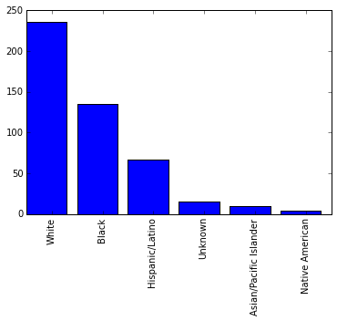
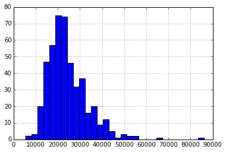

```python
import pandas as pd
police_killings = pd.read_csv("police_killings.csv", encoding="ISO_8859_1")
```


```python
police_killings.head()
```


<div style="max-height:1000px;max-width:1500px;overflow:auto;">
<table border="1" class="dataframe">
  <thead>
    <tr style="text-align: right;">
      <th></th>
      <th>name</th>
      <th>age</th>
      <th>gender</th>
      <th>raceethnicity</th>
      <th>month</th>
      <th>day</th>
      <th>year</th>
      <th>streetaddress</th>
      <th>city</th>
      <th>state</th>
      <th>...</th>
      <th>share_hispanic</th>
      <th>p_income</th>
      <th>h_income</th>
      <th>county_income</th>
      <th>comp_income</th>
      <th>county_bucket</th>
      <th>nat_bucket</th>
      <th>pov</th>
      <th>urate</th>
      <th>college</th>
    </tr>
  </thead>
  <tbody>
    <tr>
      <th>0</th>
      <td> A'donte Washington</td>
      <td> 16</td>
      <td> Male</td>
      <td>           Black</td>
      <td> February</td>
      <td> 23</td>
      <td> 2015</td>
      <td>           Clearview Ln</td>
      <td>    Millbrook</td>
      <td> AL</td>
      <td>...</td>
      <td>  5.6</td>
      <td> 28375</td>
      <td> 51367</td>
      <td> 54766</td>
      <td> 0.937936</td>
      <td> 3</td>
      <td> 3</td>
      <td> 14.1</td>
      <td> 0.097686</td>
      <td> 0.168510</td>
    </tr>
    <tr>
      <th>1</th>
      <td>     Aaron Rutledge</td>
      <td> 27</td>
      <td> Male</td>
      <td>           White</td>
      <td>    April</td>
      <td>  2</td>
      <td> 2015</td>
      <td> 300 block Iris Park Dr</td>
      <td>    Pineville</td>
      <td> LA</td>
      <td>...</td>
      <td>  0.5</td>
      <td> 14678</td>
      <td> 27972</td>
      <td> 40930</td>
      <td> 0.683411</td>
      <td> 2</td>
      <td> 1</td>
      <td> 28.8</td>
      <td> 0.065724</td>
      <td> 0.111402</td>
    </tr>
    <tr>
      <th>2</th>
      <td>        Aaron Siler</td>
      <td> 26</td>
      <td> Male</td>
      <td>           White</td>
      <td>    March</td>
      <td> 14</td>
      <td> 2015</td>
      <td>   22nd Ave and 56th St</td>
      <td>      Kenosha</td>
      <td> WI</td>
      <td>...</td>
      <td> 16.8</td>
      <td> 25286</td>
      <td> 45365</td>
      <td> 54930</td>
      <td> 0.825869</td>
      <td> 2</td>
      <td> 3</td>
      <td> 14.6</td>
      <td> 0.166293</td>
      <td> 0.147312</td>
    </tr>
    <tr>
      <th>3</th>
      <td>       Aaron Valdez</td>
      <td> 25</td>
      <td> Male</td>
      <td> Hispanic/Latino</td>
      <td>    March</td>
      <td> 11</td>
      <td> 2015</td>
      <td>      3000 Seminole Ave</td>
      <td>   South Gate</td>
      <td> CA</td>
      <td>...</td>
      <td> 98.8</td>
      <td> 17194</td>
      <td> 48295</td>
      <td> 55909</td>
      <td> 0.863814</td>
      <td> 3</td>
      <td> 3</td>
      <td> 11.7</td>
      <td> 0.124827</td>
      <td> 0.050133</td>
    </tr>
    <tr>
      <th>4</th>
      <td>       Adam Jovicic</td>
      <td> 29</td>
      <td> Male</td>
      <td>           White</td>
      <td>    March</td>
      <td> 19</td>
      <td> 2015</td>
      <td>         364 Hiwood Ave</td>
      <td> Munroe Falls</td>
      <td> OH</td>
      <td>...</td>
      <td>  1.7</td>
      <td> 33954</td>
      <td> 68785</td>
      <td> 49669</td>
      <td> 1.384868</td>
      <td> 5</td>
      <td> 4</td>
      <td>  1.9</td>
      <td> 0.063550</td>
      <td> 0.403954</td>
    </tr>
  </tbody>
</table>
<p>5 rows × 34 columns</p>
</div>


```python
%matplotlib inline
import matplotlib.pyplot as plt
import numpy as np

race_counts = police_killings["raceethnicity"].value_counts()
plt.bar(range(len(race_counts)), race_counts)
xtickloc = np.array(range(len(race_counts)))+0.5
plt.xticks(xtickloc, race_counts.index, rotation=90)
plt.show()
```





At first glance, whites make up the majority of police killings, however, upon further inspection, the proportion of whites in the population implies that minorities are being the victims of police shootings at significantly higher rates.


```python
filt = police_killings[police_killings["p_income"] != '-']
```


```python
income = filt["p_income"]
```


```python
income = income.astype(int)
```


```python
income.hist(bins=30)
```


    <matplotlib.axes._subplots.AxesSubplot at 0x7fce50c7f2e8>





```python
state_pop = pd.read_csv("state_population.csv")
```


```python
counts = police_killings["state_fp"].value_counts()
```


```python
states = pd.DataFrame({"STATE": counts.index, "shootings": counts})
```


```python
states = state_pop.merge(states, on="STATE")
```


```python
states["pop_millions"] = states["POPESTIMATE2015"] / 1000000
states["rate"] = states["shootings"] / states["pop_millions"]
df = states.sort("shootings")
pk_10lowest = df[:10]
pk_10highest = df[-10:]


states['state_fp'] = states.STATE

pk = police_killings[police_killings["share_white"] != '-']
pk = pk[pk["share_black"] != '-']
pk = pk[pk["share_hispanic"] != '-']

share_cols = ['share_white', 'share_black', 'share_hispanic']
pk[share_cols] = pk[share_cols].astype(float)

pk[['state', 'share_white', 'share_black', 'share_hispanic']]

new_pk = states.merge(pk, on="state_fp")

pk.head()

```


<div style="max-height:1000px;max-width:1500px;overflow:auto;">
<table border="1" class="dataframe">
  <thead>
    <tr style="text-align: right;">
      <th></th>
      <th>name</th>
      <th>age</th>
      <th>gender</th>
      <th>raceethnicity</th>
      <th>month</th>
      <th>day</th>
      <th>year</th>
      <th>streetaddress</th>
      <th>city</th>
      <th>state</th>
      <th>latitude</th>
      <th>longitude</th>
      <th>state_fp</th>
      <th>county_fp</th>
      <th>tract_ce</th>
      <th>geo_id</th>
      <th>county_id</th>
      <th>namelsad</th>
      <th>lawenforcementagency</th>
      <th>cause</th>
      <th>armed</th>
      <th>pop</th>
      <th>share_white</th>
      <th>share_black</th>
      <th>share_hispanic</th>
      <th>p_income</th>
      <th>h_income</th>
      <th>county_income</th>
      <th>comp_income</th>
      <th>county_bucket</th>
      <th>nat_bucket</th>
      <th>pov</th>
      <th>urate</th>
      <th>college</th>
    </tr>
  </thead>
  <tbody>
    <tr>
      <th>0</th>
      <td> A'donte Washington</td>
      <td> 16</td>
      <td> Male</td>
      <td>           Black</td>
      <td> February</td>
      <td> 23</td>
      <td> 2015</td>
      <td>           Clearview Ln</td>
      <td>    Millbrook</td>
      <td> AL</td>
      <td> 32.529577</td>
      <td> -86.362829</td>
      <td>  1</td>
      <td>  51</td>
      <td>  30902</td>
      <td>  1051030902</td>
      <td>  1051</td>
      <td>  Census Tract 309.02</td>
      <td>     Millbrook Police Department</td>
      <td> Gunshot</td>
      <td>      No</td>
      <td> 3779</td>
      <td> 60.5</td>
      <td> 30.5</td>
      <td>  5.6</td>
      <td> 28375</td>
      <td> 51367</td>
      <td> 54766</td>
      <td> 0.937936</td>
      <td> 3</td>
      <td> 3</td>
      <td> 14.1</td>
      <td> 0.097686</td>
      <td> 0.168510</td>
    </tr>
    <tr>
      <th>1</th>
      <td>     Aaron Rutledge</td>
      <td> 27</td>
      <td> Male</td>
      <td>           White</td>
      <td>    April</td>
      <td>  2</td>
      <td> 2015</td>
      <td> 300 block Iris Park Dr</td>
      <td>    Pineville</td>
      <td> LA</td>
      <td> 31.321739</td>
      <td> -92.434860</td>
      <td> 22</td>
      <td>  79</td>
      <td>  11700</td>
      <td> 22079011700</td>
      <td> 22079</td>
      <td>     Census Tract 117</td>
      <td> Rapides Parish Sheriff's Office</td>
      <td> Gunshot</td>
      <td>      No</td>
      <td> 2769</td>
      <td> 53.8</td>
      <td> 36.2</td>
      <td>  0.5</td>
      <td> 14678</td>
      <td> 27972</td>
      <td> 40930</td>
      <td> 0.683411</td>
      <td> 2</td>
      <td> 1</td>
      <td> 28.8</td>
      <td> 0.065724</td>
      <td> 0.111402</td>
    </tr>
    <tr>
      <th>2</th>
      <td>        Aaron Siler</td>
      <td> 26</td>
      <td> Male</td>
      <td>           White</td>
      <td>    March</td>
      <td> 14</td>
      <td> 2015</td>
      <td>   22nd Ave and 56th St</td>
      <td>      Kenosha</td>
      <td> WI</td>
      <td> 42.583560</td>
      <td> -87.835710</td>
      <td> 55</td>
      <td>  59</td>
      <td>   1200</td>
      <td> 55059001200</td>
      <td> 55059</td>
      <td>      Census Tract 12</td>
      <td>       Kenosha Police Department</td>
      <td> Gunshot</td>
      <td>      No</td>
      <td> 4079</td>
      <td> 73.8</td>
      <td>  7.7</td>
      <td> 16.8</td>
      <td> 25286</td>
      <td> 45365</td>
      <td> 54930</td>
      <td> 0.825869</td>
      <td> 2</td>
      <td> 3</td>
      <td> 14.6</td>
      <td> 0.166293</td>
      <td> 0.147312</td>
    </tr>
    <tr>
      <th>3</th>
      <td>       Aaron Valdez</td>
      <td> 25</td>
      <td> Male</td>
      <td> Hispanic/Latino</td>
      <td>    March</td>
      <td> 11</td>
      <td> 2015</td>
      <td>      3000 Seminole Ave</td>
      <td>   South Gate</td>
      <td> CA</td>
      <td> 33.939298</td>
      <td>-118.219463</td>
      <td>  6</td>
      <td>  37</td>
      <td> 535607</td>
      <td>  6037535607</td>
      <td>  6037</td>
      <td> Census Tract 5356.07</td>
      <td>    South Gate Police Department</td>
      <td> Gunshot</td>
      <td> Firearm</td>
      <td> 4343</td>
      <td>  1.2</td>
      <td>  0.6</td>
      <td> 98.8</td>
      <td> 17194</td>
      <td> 48295</td>
      <td> 55909</td>
      <td> 0.863814</td>
      <td> 3</td>
      <td> 3</td>
      <td> 11.7</td>
      <td> 0.124827</td>
      <td> 0.050133</td>
    </tr>
    <tr>
      <th>4</th>
      <td>       Adam Jovicic</td>
      <td> 29</td>
      <td> Male</td>
      <td>           White</td>
      <td>    March</td>
      <td> 19</td>
      <td> 2015</td>
      <td>         364 Hiwood Ave</td>
      <td> Munroe Falls</td>
      <td> OH</td>
      <td> 41.148575</td>
      <td> -81.429878</td>
      <td> 39</td>
      <td> 153</td>
      <td> 530800</td>
      <td> 39153530800</td>
      <td> 39153</td>
      <td>    Census Tract 5308</td>
      <td>          Kent Police Department</td>
      <td> Gunshot</td>
      <td>      No</td>
      <td> 6809</td>
      <td> 92.5</td>
      <td>  1.4</td>
      <td>  1.7</td>
      <td> 33954</td>
      <td> 68785</td>
      <td> 49669</td>
      <td> 1.384868</td>
      <td> 5</td>
      <td> 4</td>
      <td>  1.9</td>
      <td> 0.063550</td>
      <td> 0.403954</td>
    </tr>
  </tbody>
</table>
</div>


```python
lowest = list(pk_10lowest.STATE)
highest = list(pk_10highest.STATE)

new_pk_low = new_pk[new_pk.state_fp.isin(lowest)]
new_pk_high = new_pk[new_pk.state_fp.isin(highest)]
```


```python
pd.set_option("display.max_columns", None)

cols = ['pop', 'county_income', 'share_white', 'share_black', 'share_hispanic']
print(new_pk_low[cols].describe())
print(new_pk_high[cols].describe())

```

                    pop  county_income  share_white  share_black  share_hispanic
    count     15.000000      15.000000    15.000000    15.000000       15.000000
    mean    5031.866667   58328.000000    72.173333     9.306667        7.073333
    std     2991.855895   15623.922825    23.165259    12.323929        8.074428
    min     2619.000000   31163.000000    25.500000     0.100000        0.000000
    25%     3246.500000   46917.500000    55.500000     1.250000        2.500000
    50%     4066.000000   59018.000000    75.400000     3.700000        5.200000
    75%     5127.000000   71589.000000    94.200000    12.650000        9.500000
    max    13561.000000   79488.000000    99.600000    45.600000       32.200000
                    pop  county_income  share_white  share_black  share_hispanic
    count    260.000000     260.000000   260.000000   260.000000      260.000000
    mean    5048.934615   53632.969231    45.030000    13.189615       32.118077
    std     2582.080474   12697.837635    28.042125    19.545498       26.853527
    min      732.000000   22545.000000     0.300000     0.000000        0.100000
    25%     3535.750000   45700.000000    20.550000     1.075000        9.650000
    50%     4699.000000   53137.000000    45.600000     5.600000       23.800000
    75%     5923.500000   56853.000000    68.750000    17.550000       50.000000
    max    26826.000000   91702.000000    96.500000    95.600000       98.800000


```python
dummy_low = {}
dummy_high = {}
for column in cols:
    dummy_low[column] = new_pk_low[column].mean()
    dummy_high[column] = new_pk_high[column].mean()
    
```


```python
print(dummy_low, dummy_high)
```

    {'share_hispanic': 7.0733333333333333, 'share_black': 9.3066666666666666, 'pop': 5031.8666666666668, 'county_income': 58328.0, 'share_white': 72.173333333333346} {'share_hispanic': 32.11807692307692, 'share_black': 13.189615384615385, 'pop': 5048.9346153846154, 'county_income': 53632.969230769231, 'share_white': 45.029999999999994}


```python

```
